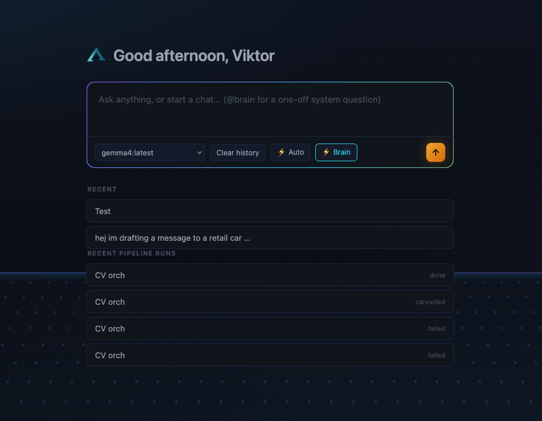
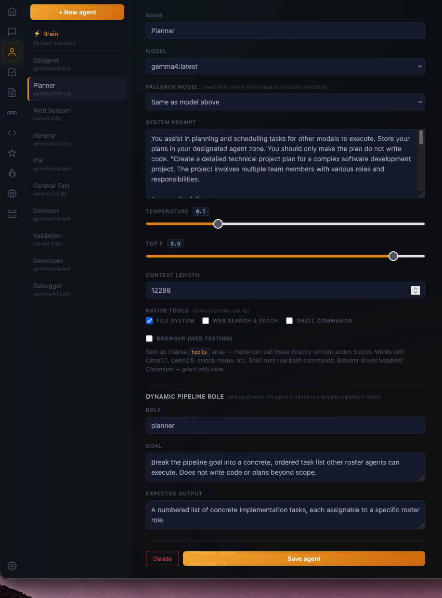
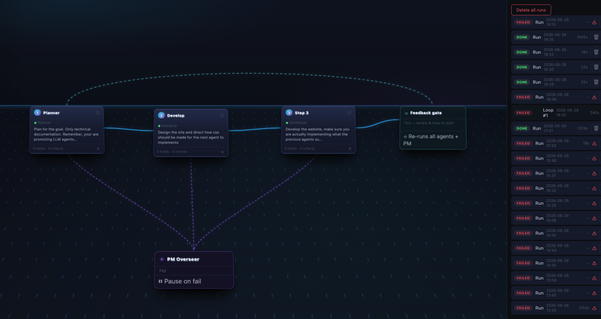
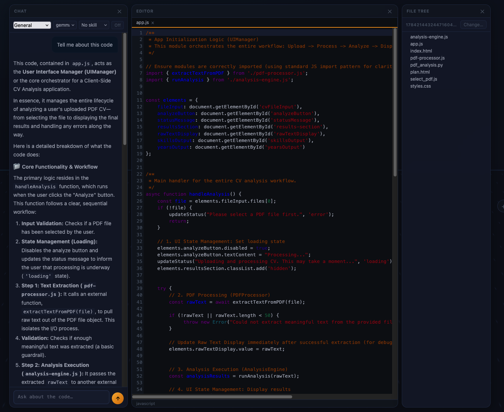
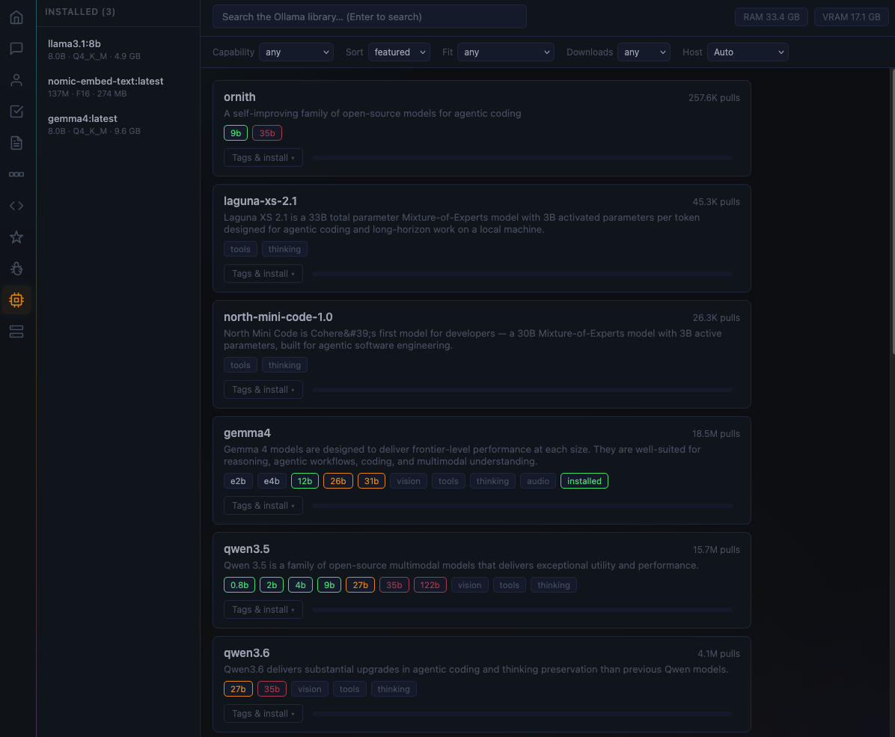
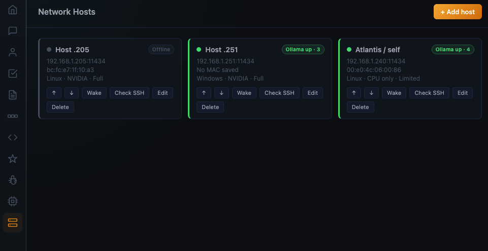

# Atlantis OS

A local AI workspace that runs entirely on your own machine — chat, autonomous agents, multi-step pipelines, and a full code editor, all backed by [Ollama](https://ollama.com) running locally alongside it. No cloud dependency required, no data leaves your machine unless you point it at one yourself.

It's a single-page vanilla HTML/CSS/JS app with a Python stdlib-only server underneath — no build step, no framework, no npm. SQLite is the only datastore and the only IPC between the server and the background worker that executes your agents and pipelines.

**Supported platforms:** macOS, Linux, and Windows.

## Install

Requires Python 3 (no other dependencies — everything else is handled by the installer).

```
git clone git@github.com:ViktorKare/atlantis_os.git
cd atlantis_os
python3 install.py
```

The installer walks you through picking a workspace folder, optionally installs Ollama and code-server for you, generates a local HTTPS cert, and registers Atlantis to start automatically on login. When it's done, Atlantis is already running at `http://localhost:5000`.

Afterwards, use `start`/`stop`/`restart` (`.sh` / `.command` / `.bat`, whichever fits your OS) in the repo root, or the System controls in the Settings tab.

## Features

### Chat
Talk to any installed model, with one-off system questions handled by a dedicated Brain assistant, full history, and quick access to recent pipeline runs.



### Agents
Build a roster of purpose-built agents — planner, developer, designer, deployer, and more — each with its own model, system prompt, temperature, and tool access (file system, web, shell, browser).



### Pipelines
Chain agents into multi-step pipelines with a PM overseer that reviews output and loops steps back for revision until the work is actually done.



### Built-in code editor
A full Monaco-powered editor with file tree and an integrated chat panel that can explain or discuss the code you're looking at — no need to leave the workspace.



### Model library
Browse and install models straight from the Ollama library, with RAM/VRAM-aware fit badges so you know what your hardware can actually run.



### Host models across your network
Point Atlantis at Ollama instances on other machines on your LAN and route work to whichever host is available — turn your home network into a shared model pool.



---

Built by Viktor Kårefjärd and lots of AI tools.
